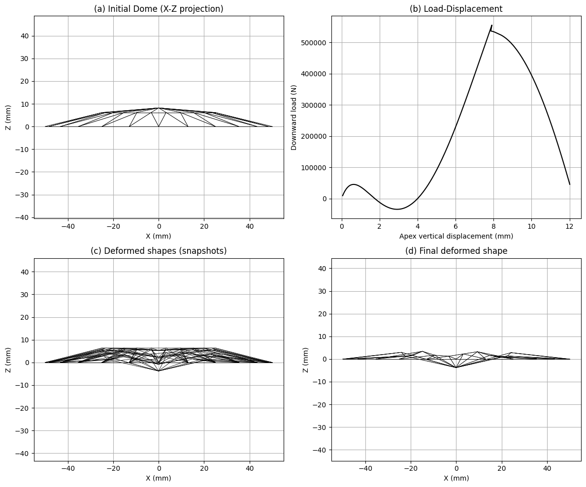
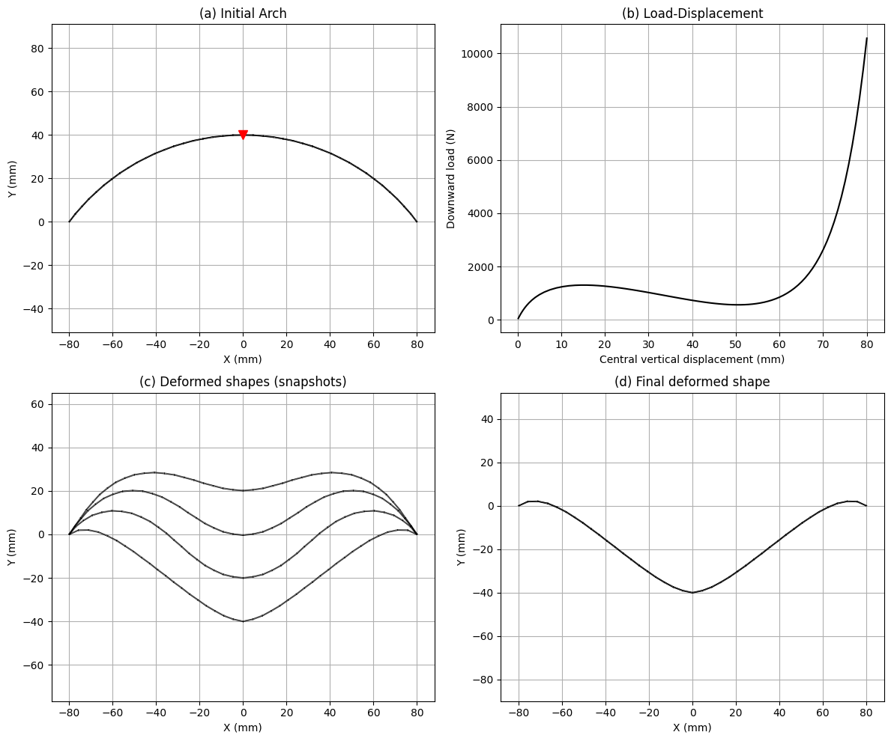
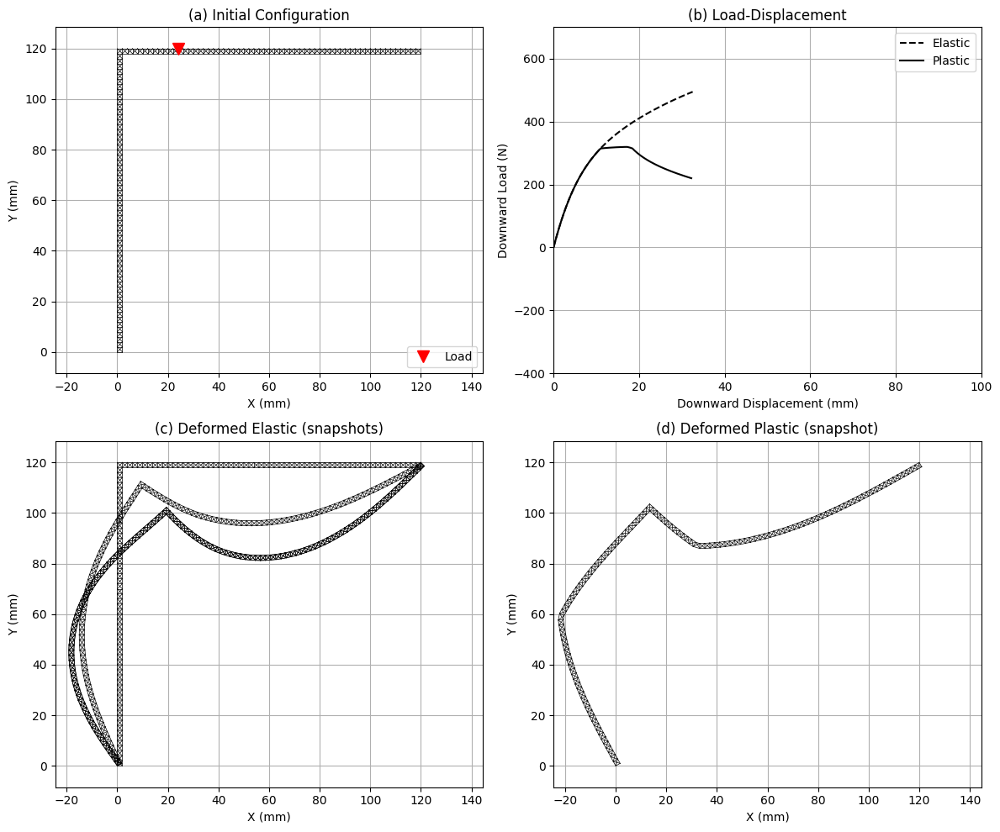
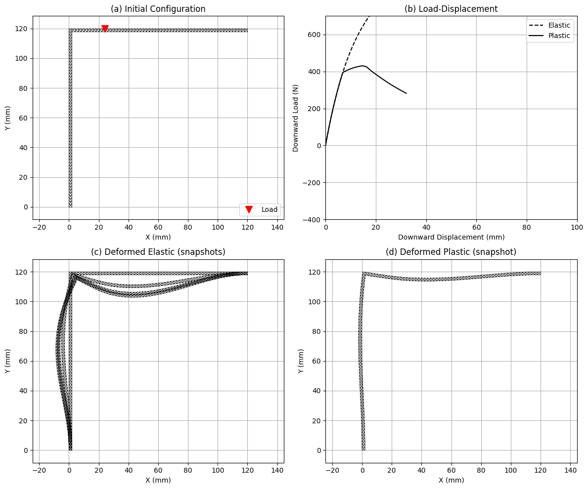

# Non-Linear Truss Analysis

This repository contains a Python implementation for the non-linear analysis of truss structures, capable of handling both geometric non-linearities (large deformations) and material non-linearities (elastoplasticity). It is based on the algorithmic procedures described in **Chapter 3 of Bonet & Wood**.

## Problem Statement

The main objective is to determine the equilibrium path of truss structures under external loading. The code handles:
*   **Geometric Non-linearity**: Using a logarithmic strain measure to account for finite strains and large rotations.
*   **Material Non-linearity**: Implementing an elastoplastic material model with isotropic hardening.
*   **Instability**: Capturing snap-through and snap-back phenomena using path-following techniques.

## Mathematical Formulation

The following algorithms are implemented to solve the non-linear system.

### 1. Global Newton-Raphson Solver with Arc-Length Control

The equilibrium path is traced using a predictor-corrector scheme. 
*   **Residual Force**: Given the external force $\mathbf{T}_{ext}$ and internal forces $\mathbf{T}_{int}$, the residual is $\mathbf{R} = \mathbf{T}_{ext} - \mathbf{T}_{int}$.
*   **Linearization**: The system $\mathbf{K} \delta \mathbf{u} = \mathbf{R}$ is solved for the displacement increment $\delta \mathbf{u}$, where $\mathbf{K}$ is the global tangent stiffness matrix.

### 2. Kinematics: Logarithmic Strain

For a truss element with initial length $ and current length $, the logarithmic strain is defined as:
97871
\varepsilon = \ln\left(\frac{l}{L}\right)
97871
This measure is energetically conjugate to the Kirchhoff stress $\tau$.

### 3. Material Point Algorithm (Return Mapping)

The elastoplastic constitutive behavior is handled via a return mapping algorithm at the element level.

#### Elastic Predictor
Assume the step is purely elastic:
97871
\tau^{trial} = E (\varepsilon_{n+1} - \varepsilon_{p,n}) \
\Phi^{trial} = |\tau^{trial}| - (\sigma_{y0} + H \alpha_n)
97871

#### Plastic Corrector
If $\Phi^{trial} > 0$ (yielding), the stress and history variables are corrected:
1.  **Plastic Multiplier**: $\Delta \gamma = \frac{\Phi^{trial}}{E + H}$
2.  **Stress Update**: $\tau_{n+1} = \tau^{trial} - E \Delta \gamma \, \text{sign}(\tau^{trial})$
3.  **Plastic Strain**: $\varepsilon_{p,n+1} = \varepsilon_{p,n} + \Delta \gamma \, \text{sign}(\tau^{trial})$
4.  **Accumulated Plastic Strain**: $\alpha_{n+1} = \alpha_n + \Delta \gamma$
5.  **Consistent Tangent**: {alg} = \frac{EH}{E + H}$

### 4. Element Formulation

The implementation derives the internal force and stiffness matrix exactly.

*   **Internal Force Vector**:
    97871
    \mathbf{f}_{int} = \frac{V \tau}{l} \begin{bmatrix} -\mathbf{n} \ \mathbf{n} \end{bmatrix}
    97871
    where $ is volume, $\tau$ is Kirchhoff stress, $ is current length, and $\mathbf{n}$ is the current unit vector.

*   **Tangent Stiffness Matrix**:
    The stiffness matrix $\mathbf{K}$ consists of material and geometric contributions:
    97871
    \mathbf{K} = (\mathbf{k}_{mat} + \mathbf{k}_{geo}) \begin{bmatrix} 1 & -1 \ -1 & 1 \end{bmatrix}
    97871
    where:
    97871
    \mathbf{k}_{mat} = \frac{V E_{alg}}{l^2} (\mathbf{n} \otimes \mathbf{n})
    97871
    97871
    \mathbf{k}_{geo} = \frac{V \tau}{l^2} (\mathbf{I} - \mathbf{n} \otimes \mathbf{n})
    97871

## Examples

The repository includes several benchmark examples.

### 1. Shallow Dome (`dome_example.py`)
A 3D shallow truss dome subjected to a central point load. This problem exhibits complex snapping behavior (snap-through).



### 2. 2D Arch (`arch_example.py`)
A deep circular arch modeled with truss elements. It typically demonstrates limit points and unstable branches in the load-displacement curve.



### 3. Lee's Frame (`lee_frame.py`)
A classic benchmark problem involving a frame structure. This implementation models the frame using a "trussed" equivalent (two chords with cross-bracing) to simulate bending behavior using only truss elements.

#### Unclamped Boundary Calculation


#### Clamped Boundary Calculation


## Usage

To run an example, simply execute the corresponding Python script:

```bash
python arch_example.py
```

Ensure you have the required dependencies installed:
```bash
pip install numpy matplotlib
```
